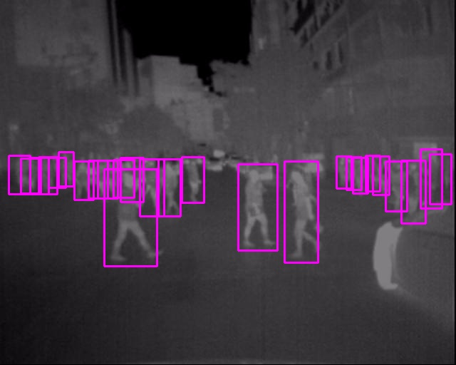
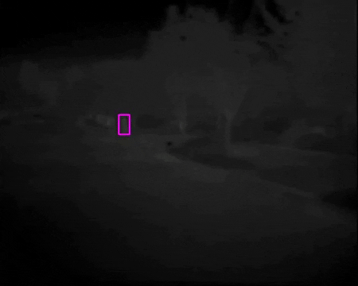

# Another Implementation of YOLOv3 with Pytorch
## Training YOLOv3 on KAIST and FLIR dataset for Pedestrian Detection task in Thermal Imagery.
### This work is for our Best Student Paper award at ICIAP 2019 with the title: <a href="https://www.researchgate.net/publication/335603374_Domain_Adaptation_for_Privacy-Preserving_Pedestrian_Detection_in_Thermal_Imagery"> Domain Adaptation for Privacy-Preserving Pedestrian Detection in Thermal Imagery </a>

 
This repository is forked from great work pytorch-yolov3 of <a href="https://github.com/andy-yun/pytorch-0.4-yolov3">@github/andy-yun </a> 
. However, this repository is changed many files and functions for our research.

### Improvement of this repository
* Developed a state-of-the-art result for Pedestrian detection task on KAIST and FLIR dataset.
* Added implementation of Bottom-up adaptation and Layer-wise adaptation.
* Added cross-validation during training by setting 10% of validation set and 90% of training set.
* Added training procedure decay learning rate by training loss and validation recall.
* Improved update learning rate by step epoch.
* Added calculation mean Average Precision (mAP) and Log Average Miss Rate (Miss rate) on daytime and nighttime of KAIST dataset. 
* Added drawing bounding boxes on images based on detection results and ground-truth annotation.
* Added function to convert YOLO output result to JSON format for evaluation miss rate.
* Improved training procedure by monitor the training loss and validation performance during training. 
* Added functions detect result on a folder or from a video.

### How to run this repository
1. Download or clone this repository to your computer.
2. Install some basic requirements if needed.
3. Download <a href="https://drive.google.com/file/d/1Kyoyira0liRRr_FOY8DDSeATLQAwXtu-/view?usp=sharing">kaist_thermal_detector.weights</a> or <a href="https://drive.google.com/file/d/1xx4nhja95VeFsZydTycD8ArTYl1p-bnx/view?usp=sharing">flir_detector.weights </a> files and put in the directory 'weights'.
4. Open a terminal and run following commands according to functions:

Noted that all of these instructions for Linux environment (for Windows, you should visit original repository to read more)

### Some default parameters:
* weightfile = weights/kaist_thermal_detector.weights 
* configurationfile = cfg/yolov3_kaist.cfg 
* datafile = data/kaist.data
* listname = data/kaist_person.names
For all of following commands,if command with [...] will be an option,
you can use your parameter or leave there to use default paramaters above.


### Detection (detect bounding box):
Detect bounding box result on image(s) or video by parameter: 
image file or folder with all images or video file. 
The result will appear with the same name + 'predicted'
```
python detect.py image/video/folder
Example:
python detect.py thermal_kaist.png
```

### Test mAP (mean Average Precision):
Test mean Average Precision as well as Log Average Miss Rate of the detector over the test set
Noted that, Log Average Miss Rate and Precision on daytime and nighttime only on KAIST dataset.
```
python map.py weightfile
```

### Evaluation PR (precision, recall, corrects, fscore):
```
python eval.py [weightfile]
```

### Draw bounding box:
Given the folder of images with its annotation.
Drawing bounding box on every image with correct detection (blue boxes),
wrong detection (red boxes) and miss detection (green boxes)

```
python drawBBxs.py imagefolder
```

### Train your own data or KAIST data as follows:
Before training on KAIST or FLIR or your own dataset, you should prepare some steps as follow:
1. Dataset (download <a href="https://drive.google.com/file/d/14A3K2IPPPC8-BwPh-YjeHARaZqjnR655/view?usp=sharing">KAIST_dataset </a> and place on a directory any place (better at root or in current directory))
2. Modify the link to dataset at data/train_thermal.txt and test_thermal.txt.
3. Check some parameters in configuration files: data/kaist.data, cfg/yolov3_kaist.cfg such as train on thermal or visible, learning rate, etc,. 

Then you can run experiments.
```
python train.py [-x y]
```
With -x and y as follow:
* -e: epoch (y is the number of epoch), defaut 50 epochs.
* -w: weightfile (y is the path of your weight file for pre-train), default kaist_thermal_detector.weights
* -d: datafile (y is the path of your data file), default data/kaist.data train on thermal images.
* -c: cfgfile (y is the path of your cfg file), default cfg/yolov3_kaist.cfg with lr=0.001

For example, if you want to train from yolov3 weight for a maximum of 100 epoch, you have:
```
python train.py -w weights/yolov3.weights -e 100 
```

* Weight and model files are saved in a backup folder at each epoch, and log of training saved in savelog.txt

* You __should__ notice that you can control everything in train.py


### Monitor loss during training:
See the loss curve during training, also precision, recall curve for every epoch

```
python seeloss.py
```


### Demo on webcam:
Please check it

```
python demo.py
```


### Example results:


[](https://youtu.be/FB4fYIIMhX0 "Click to play on Youtube.com")

### Results:
KAIST dataset:
* mean Average Precision (mAP): 60.7%
* Precision day & night: 82.36%	     Precision daytime: 77.44% 	    Precision nighttime: 92.76% 
* Miss rate day & night: 25.61% 	 Miss rate daytime: 32.69% 	    Miss rate nighttime: 10.87% 

FLIR dataset results (precision):
* person:    	75.6%
* bicycle:   	57.4%
* car:         	86.5%

mean Average Precision:  	73.2%

## Citation
We really hope this repository is useful for you. Please cite our paper as
```
@inproceedings{kieu2019domain,
	Author = {Kieu, My and Bagdanov, Andrew D and Bertini, Marco and Del Bimbo, Alberto},
	Booktitle = {Proc. of International Conference on Image Analysis and Processing (ICIAP)},
	Title = {Domain Adaptation for Privacy-Preserving Pedestrian Detection in Thermal Imagery},
	Year = {2019}
	}

```

If you have any comment or question about this repository, please leave it in Issues.

Other question, please contact me by email: my.kieu@unifi.it.

Thank you.
